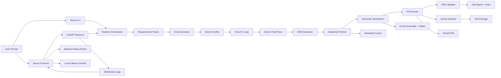

# Nexus


**Nexus is the AI command deck for circuit synthesis, verification, placement, and fabrication readiness.**

## What is Nexus

Nexus is a dual-LLM PCB workflow where Groq generates circuit artifacts, Gemini challenges them, and the pipeline loops until the design is stronger. It includes a CLI, a FastAPI backend, and a React control room.

## Full Architecture



## Quick demo

```bash
pcb info
pcb generate "555 timer with LED"
pcb validate --input build/design.kicad_pcb --fab jlcpcb
pcb export --input build/design.kicad_pcb --output build/gerbers
```

## Installation

```bash
python -m venv .venv
.venv\Scripts\Activate.ps1
pip install -e .
cd frontend
npm install
```

## .env

```env
GROQ_API_KEY=
GROQ_MODEL=llama-3.3-70b-versatile
GEMINI_API_KEY=
GEMINI_MODEL=gemini-2.0-flash
GENERATOR_LLM=groq
VERIFIER_LLM=gemini
OLLAMA_BASE_URL=http://localhost:11434
OLLAMA_MODEL=mistral
KICAD_OUTPUT_DIR=./build
KICAD_CLI_PATH=kicad-cli
LOG_LEVEL=INFO
DFM_MIN_TRACE_WIDTH_MM=0.2
DFM_MIN_CLEARANCE_MM=0.2
DFM_MIN_VIA_DIAMETER_MM=0.4
JLCPCB_MIN_TRACE_WIDTH_MM=0.127
MAX_VERIFICATION_ROUNDS=3
MIN_CONFIDENCE_SCORE=75
```

## Quickstart

1. Copy `.env.example` to `.env` and add your keys.
2. Start the API with `uvicorn pcbai.api.main:app --reload --port 8000`.
3. Start the frontend with `cd frontend && npm run dev`.

## Web dashboard

The frontend lives in [frontend](frontend) and is designed to deploy cleanly to Vercel. It includes:

- backend connection status
- dual-LLM verification live panel
- xterm terminal logs
- settings for Groq, Gemini, and local Ollama
- footer and motion-heavy dark UI

## Command reference

- `pcb generate "description" --optimize thermal|signal|default`
- `pcb verify --input build/design.netlist.json`
- `pcb validate --input build/design.kicad_pcb --fab jlcpcb|pcbway|generic`
- `pcb export --input build/design.kicad_pcb --output build/gerbers`
- `pcb info`

## Roadmap

- richer KiCad symbol generation
- deeper SKiDL integration
- better placement heuristics
- more fab presets
- backend split into dedicated `backend/` deploy package

## Contributing

- keep `src/pcbai/steps/footprint_generator.py` untouched unless explicitly requested
- use Pydantic v2 models for pipeline contracts
- add docstrings and type hints everywhere
- test CLI and frontend integration when changing API contracts
